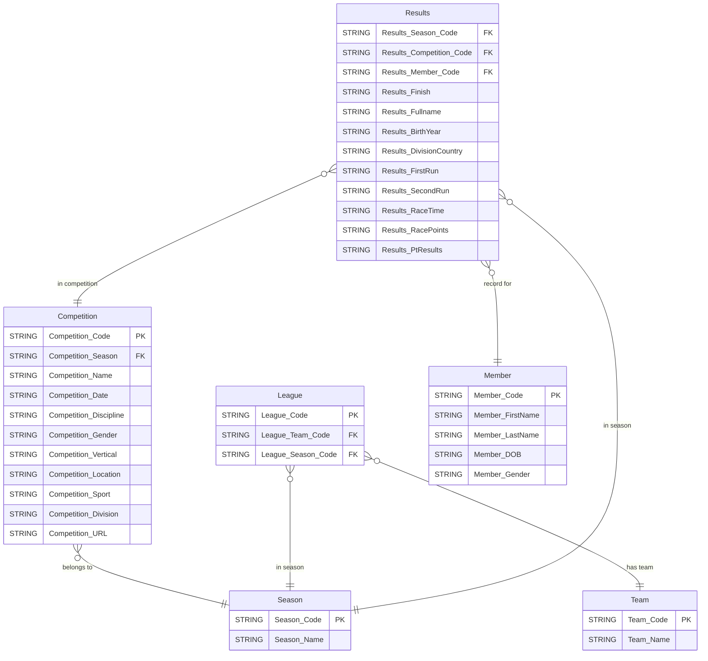

# Big Query Table Schema

```mermaid
erDiagram
    Competition {
        STRING Competition_Code PK
        STRING Competition_Season FK
        STRING Competition_Name
        STRING Competition_Date
        STRING Competition_Discipline
        STRING Competition_Gender
        STRING Competition_Vertical
        STRING Competition_Location
        STRING Competition_Sport
        STRING Competition_Division
        STRING Competition_URL
    }

    League {
        STRING League_Code PK
        STRING League_Team_Code FK
        STRING League_Season_Code FK
    }

    Member {
        STRING Member_Code PK
        STRING Member_FirstName
        STRING Member_LastName
        STRING Member_DOB
        STRING Member_Gender
    }

    Results {
        STRING Results_Season_Code FK
        STRING Results_Competition_Code FK
        STRING Results_Member_Code FK
        STRING Results_Finish
        STRING Results_Fullname
        STRING Results_BirthYear
        STRING Results_DivisionCountry
        STRING Results_FirstRun
        STRING Results_SecondRun
        STRING Results_RaceTime
        STRING Results_RacePoints
        STRING Results_PtResults
    }

    Season {
        STRING Season_Code PK
        STRING Season_Name
    }

    Team {
        STRING Team_Code PK
        STRING Team_Name
    }

    Competition }o--|| Season : "belongs to"
    League }o--|| Team : "has team"
    League }o--|| Season : "in season"
    Results }o--|| Season : "in season"
    Results }o--|| Competition : "in competition"
    Results }o--|| Member : "record for"
```
